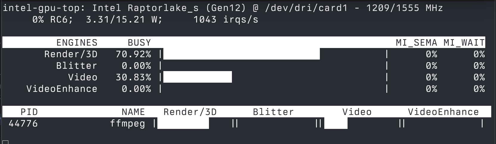

# ironicbadger/qsv-docker

A simple QuickSync Video (QSV) capable container designed to be run as a one-shot. It can be used as part of a video processing toolchain, or standalone to encode files using ffmpeg and QSV whilst keeping your host system clean.

This container assumes your host system has a working QuickSync Video implementation.

## Usage

Build the image with `docker build -t qsv-transcoder .`.

### 1. Test with Sample Video

Download and test with a sample video file:

```bash
# Download test video
wget https://ssh.us-east-1.linodeobjects.com/ribblehead_1080p_h264.mp4 -O /tmp/test_video.mp4

# Run QSV transcoding test
docker run --rm \
  --device=/dev/dri:/dev/dri \
  -v /tmp:/input:ro \
  qsv-transcoder \
  -hwaccel qsv -c:v h264_qsv \
  -i /input/test_video.mp4 \
  -c:v h264_qsv -preset balanced -global_quality 25 \
  -f null -
```

You may wish to monitor progress using `intel_gpu_top` to ensure the hardware encoders are being used.



### 2. Use it with your own files

To use the container with your own files, replaced `-f null -` thus:

```bash
docker run --rm \
  --device=/dev/dri:/dev/dri \
  -v /tmp:/input:ro \
  -v /tmp/output:/output \
  qsv-transcoder \
  -hwaccel qsv -c:v h264_qsv \
  -i /input/test_video.mp4 \
  -c:v h264_qsv -preset balanced -global_quality 25 \
  /output/encoded_video.mp4
```

## AV1 Encoding (Arc GPUs and newer) UNTESTED

```bash
docker run --rm \
  --device=/dev/dri:/dev/dri \
  -v $(pwd)/input:/input:ro \
  -v $(pwd)/output:/output \
  qsv-transcoder \
  -i /input/source.mp4 \
  -c:v av1_qsv \
  -preset medium \
  -global_quality 30 \
  -c:a copy \
  /output/av1_output.mp4
```